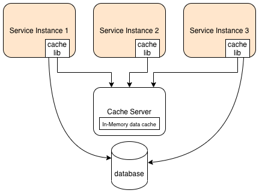
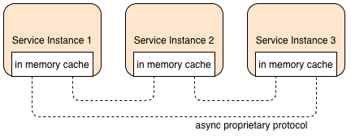
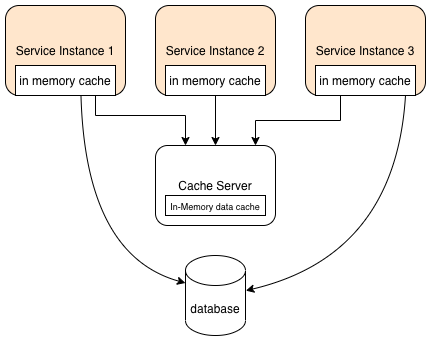
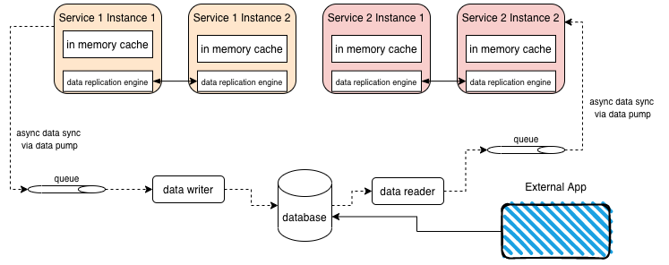

## Topologies
### Distributed
A distributed cache is a client-server style cache. It is the cached data that is distributed, i.e. it's distributed between
all the services that use it but there's only a single cache server/service.

* Uses a separate server (e.g. redis or ignite etc)
* All services using it use a client library to use the cache.
* Each service does not have cached data; It has to access it from the server
* Not fault tolerant, unless using a cluster

The cache can store the data as

| Type | Description |
|---|---|
| IMDG |In Memory Data Grid - Simple|
| IMDB |In Memory DataBase - Can have a schema and thus be more complex, allows use of SQL like queries against the cached data|

### Replicated
This type of caching topology requires no external server. The cached data resides in each service, in memory. The cache
 engine takes care of replicating the cached data amongst all instances, so it has "eventual consistency". Fewer products 
offer this type of caching compared to [Distributed](#Distributed), including [Ignite](https://ignite.apache.org/), 
[Hazelcast](https://hazelcast.com/use-cases/caching/), [GemFire](https://tanzu.vmware.com/gemfire), 
[Coherence](https://www.oracle.com/middleware/technologies/coherence.html) and 
others.

Eventual consistency is a by-product of how the cache operates. E.g. after a "put" onto the cache, the cache engine updates
the other instances in the background. Some systems allow concepts like `syncput()` to force consistency, but this shouldn't
usually be necessary. The data replication engine (e.g. ignite) maintains a socket level connection to the other instances.

>Beware of your cache size! 
> 
>For example on a shared host running a kubernetes cluster, 30 instances each with a 200 MB cache requires 6 GB of data!.

Similar to above, this topology is not viable if you have large and/or lots of storage and/or instances.

### Near Cache
The near cache hybrid is a combination of a distributed and replicated cache. Each service has its own in memory cache, 
known as the **front cache** (or MRU, or MFU cache depending on the eviction strategy used - see later). There is also a 
distributed cache holding the full data set, known as the **full backing cache**. 

* There are no communications between services for cache management like in a replicated cache, instead this is managed by 
the backing cache.
* It allows a large amount of cached data in the full (backing) cache
* A smaller subset of data is stored in each service's front cache which might use MRU or MFU.
* Individual front cache's can therefore contain different datasets to each other  
* It can suffer from inconsistent response times in some environments, especially in a microservice environment. This is
 because the data might not exist in the local front cache, so we have to go to the backing cache, and maybe even all the
 way to the database.
  
## Comparing Topologies
| | Replicated | Distributed | Near Cache |
|---|---|---|---|
| optimisation|performance|consistency|balanced|
| cache Size|small (<100 MB)|large (500 MB +)|large (500 MB +)|
| type of data|relatively static|transactional|relatively static|
| update frequency|relatively low|high|relatively low|
| fault tolerance|high|low|low|
| responsiveness|high|medium|variable|

## Spaced-based microservices
A challenge of microservices, particularly in migrating to them from a monolith, is how each service has its own data and 
does not require access to a large central shared database. If there were many services sharing the same database, attempting
 to make a schema change to that database would require very careful choreography to prevent breaking any services (or more 
likely, you simply wouldn't be able to make the change without breaking something).

With caching you can share a single database in a microservice environment. You can even version database changes, increase 
performance, use cloud based data sync but on-prem database, and still have simple reporting and data analytics.

All data is stored in memory using replicated caches. Each service's cache is a sub-set of the data in the database, but 
a full data set for that particular services needs. Even if you have large database that is not practical to cache (e.g. 
2 TB), the data required for an individual microservice might only be 200 MB of that 2 TB.

### Reading from the database
Reads from the database can happen in the following circumstances
* An external application updates the database. An async data writer will (eventually) update the cache data in this case
* Cold starts - i.e. no instance of the service is already running from which to clone the data. This could be because 
we lost all instances, or needed to perform a schema change or redeploy etc
* Archiving of data (so cache needs renewing/refreshing)

### Data Collisions
When two service instances are operating at the same time, data collisions can occur. For example in an inventory 
system, both instance caches might have the same stock level for an item, and both perform separate operations to decrement 
the stock by different amounts (e.g. for different orders) _at the same time_. This means the service that completes last, 
overwrites the change made by the first services operation. 

This can be mitigated by not updating local caches but by performing a put operation to a queue. An `inventory adjust` service 
could then be created to read from this queue, apply each update in turn to itself and its own cache which would then replicate 
to the other services as normal. The trade-off is the time to eventual consistency.

## Cache eviction policies
### TTL
Time to live, is a simple timeout parameter. It doesn't address a full cache scenario
### ARC
Archive policy (ARC) evicts item based on date created (NOT when it was added to the cache). For example evict all items 
older than 6 months. It doesn't address a full cache scenario
### LFU
Least frequently used. Items have an internal "count" of how often it is read. A put operation must reset this internal 
count for all items (otherwise the item just added would most likely be evicted again), so this can be suboptimal.
### LRU
Least recently used. All items get an "age". Oldest item gets evicted on put. On cache item hit, that individual items age 
is set to zero and all other items ages are incremented. This is more effective than LFU, but more expensive because of 
the re-aging process.
### RR
Random replacement. If doing a put on a full cache, then randomly evict an item. This can be a good initial strategy if 
you don't know much about you data / hotspots, or for when data access is inconsistent or non-deterministic.
