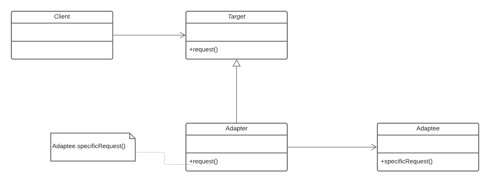

This is a common pattern that can be used by many other patterns. The GoF states that the intention of the adapter pattern is to

> Convert the interface of a class into another interface that the clients expect.
> Adapter lets classes work together that could not otherwise because of incompatible interfaces.

You would use the adapter pattern where you have an existing object that does something the way you want it to, but has 
the wrong interface and it's unacceptable to change the interface for this class. 
You can also use the adapter pattern to add more functionality to an existing object without changing its interface.

## Key Features

### Intent

To match an existing object beyond your control to a particular interface

### Problem

A system has the right behaviour but the wrong interface. Typically used when you have to make something a derivative of
an abstract class.

### Solution

The Adapter provides a wrapper with the desired interface.

### Consequences

The client can now use the pre-existing `Adaptee` as if it were the target type

The Class Adapter Pattern implements the adapter pattern using multiple inheritance (this applies to C++, but could be 
used in Java with an interface class).
