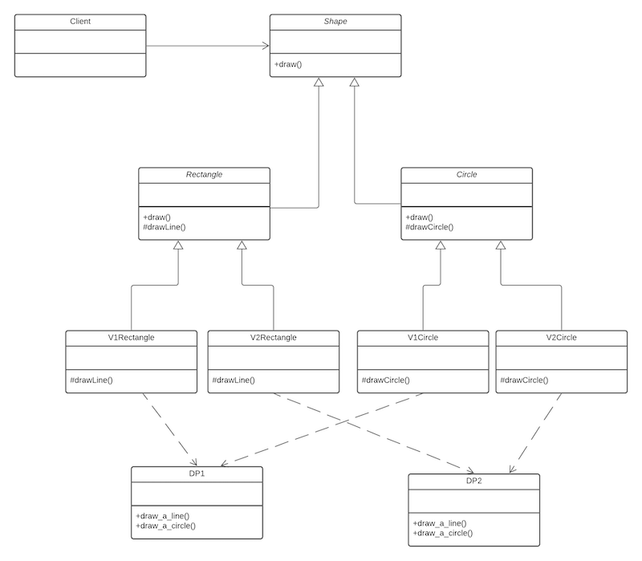

The bridge pattern is similar to the [strategy pattern](strategy), where you define a family of algorithms, encapsulate each one, and make them interchangeable.  Strategy lets the algorithm vary independently from clients that use it. The bridge pattern decouples an abstraction from its implementation so that the two can vary independently.

Consider the following example: A system comprises of shapes which must be drawn. There are different implementations of the shapes, and different drawing programs to draw the shape. Using inheritance specialisation to solve this problem results in a class explosion (especially as new shape or drawing program implementations are added). An inheritance based solution would produce the following class diagram.

What would happen in the above solution if a new "V3" drawing implementation and another shape was added to the system? We have a class explosion as each shape must know its type of drawing program (DP), hence it is also tightly coupled to it.

### How the bridge pattern can help

We need to separate (decouple) the variations in abstraction (shape) from the variations in implementation (draw) so that the two can vary independently. The two basic strategies to use to move towards a solution are

*   Encapsulate what varies (behind an abstract class)
*   Favour composition over inheritance

The shape and drawing vary, therefore these become our abstract classes. Then we tie the two together using aggregation (composition). This produces the following class diagram (which implements the bridge pattern):

To clarify the opening statements about the bridge pattern, **the** **abstraction** defines the interface for the objects being implemented (shapes). **The implementor** defines the interface for the specific implementation classes (drawing programs). Classes derived from `Abstraction` use classes derived from `Implementor` without knowing which particular concrete implementor is in use. This decouples the implementations from the objects that use them.

### Class diagram for the bridge pattern

### Why not use the adapter pattern?

The [adapter pattern](adapter) works well and the implementation isn’t too different from the bridge pattern (but it is different). However we need to discuss when to use the adapter versus the bridge.

The adapter is great if you are adapting concrete functionality from one application to be used by another.  In other words, I need to adapt Application A so that it looks like it is part of Application B.

The Bridge pattern is better suited for designing a system where you expect to add additional functionality over time, but you want your architecture to be flexible enough to handle the changes without becoming brittle.  This brittleness often occurs as you attempt to add new functionality using traditional factoring and “Is-A” mentality.