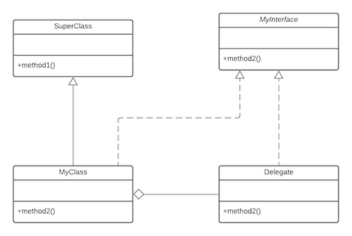

So how exactly do **composition** and **inheritance** compare? Here are several points of comparison:

*   It is easier to **change the interface of a back-end class** (composition) than a superclass (inheritance). A change 
    to the interface of a back-end class necessitates a change to the front-end class _implementation_, but not necessarily 
    the front-end interface. Code that depends only on the front-end interface still works, so long as the front-end interface 
    remains the same. By contrast, a change to a superclass's interface can not only ripple down the inheritance hierarchy 
    to subclasses, but can also ripple out to code that uses just the subclass's interface see the [fragile base class](fragile) 
    for an example.
    
*   It is easier to **change the interface of a front-end class ** (composition) than a subclass (inheritance). Just as 
    superclasses can be fragile, **subclasses can be rigid**. You can't just change a subclass's interface without 
    making sure the subclass's new interface is compatible with that of its parent (supertypes). For example, you can't 
    add to a subclass a method with the same signature but a different return type as a method inherited from a superclass. 
    Composition, on the other hand, allows you to change the interface of a front-end class without affecting back-end classes.
    
*   Composition_allows you to **delay the creation of back-end objects** until (and unless) they are needed, as well as 
    changing the back-end objects dynamically throughout the lifetime of the front-end object. With _inheritance_, you get 
    the image of the superclass in your subclass object image as soon as the subclass is created, and it remains part of 
    the subclass object throughout the lifetime of the subclass.
    
*   It is **easier to add new subclasses** (inheritance) than it is to add new front-end classes (composition), because 
    **inheritance comes with polymorphism**. If you have a bit of code that relies only on a superclass interface, that 
    code can work with a new subclass without change. This is not true of composition, unless you use composition with interfaces. 
    Used together, **composition and abstract (or interface) classes** make a very powerful design tool.
    
*   The explicit **method-invocation forwarding** (or delegation) approach of composition will often have a **performance 
    cost** as compared to inheritance's single invocation of an inherited superclass method implementation.
    
*   With both composition and inheritance, **changing the implementation** (not the interface) of any class is easy. 
    The ripple effect of implementation changes remain inside the same class.
    
## Choosing between composition and inheritance
So how do all these comparisons between composition and inheritance help you in your designs? Here are a few guidelines 
that reflect how I tend to select between composition and inheritance.

**Make sure inheritance models the _is-a_ relationship.** The main guiding philosophy is that inheritance should be used 
only when a subclass _is-a_ superclass. For example, an `Apple` likely _is-a_ `Fruit`, so I would be inclined to use inheritance.
An important question to ask yourself when you think you have an _is-a_ relationship is whether that _is-a_ relationship 
will be constant throughout the lifetime of the application and, with luck, the lifecycle of the code. For example, you might 
think that an `Employee` _is-a_ `Person`, when really `Employee` represents a role that a `Person` plays part of the time. 
What if the person becomes unemployed? What if the person is both an `Employee` and a `Supervisor`? Such impermanent _is-a_ 
relationships should usually be modeled with composition.

**Don't use inheritance just to get code reuse** If all you really want is to reuse code and there is no _is-a_ relationship 
in sight, use composition.

**Don't use inheritance just to get at polymorphism** If all you really want is polymorphism, but there is no natural 
_is-a_ relationship, use composition with abstract classes.
