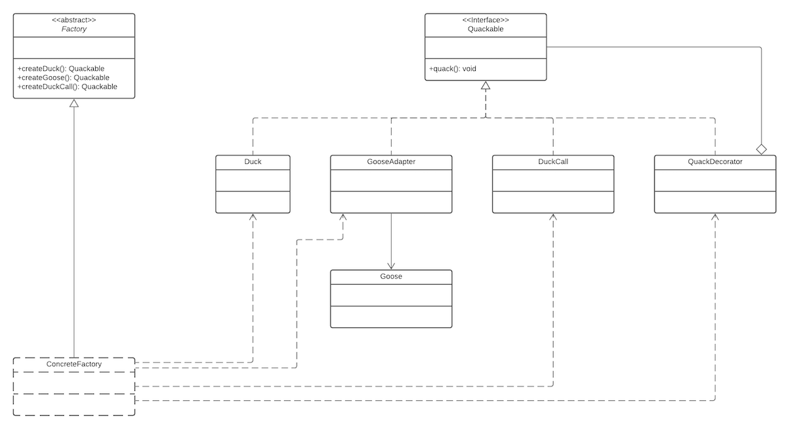

A lot of patterns work together very well to form compound patterns. Shown is a UML class diagram that implements various 
design patterns to form a compound pattern. Here are some notes describing how and why this design was arrived at.

1.  **Polymorphism** was introduced by the use of the`Quackable` **interface**. This makes a number of design patterns 
    available to us.
2.  The **decorator pattern** is used to allow us to track the number of times the method quack() is called. Using the 
    decorator pattern means we don't have to modify `Duck` and `DuckCall`
    *   `QuackDecorator` _implements_ `Quackable` so it can be referenced as a `Quackable` type
    *   `QuackDecorator` _has a_ `Quackable` instance variable so it can be passed a `Quackable` type
    *   `QuackDecorator` is the first object in the chain, so it's `quack()` method is called first. This allows it to 
        update a counter variable, then call the `quack()` of its `Quackable` instance variable
3.  To use the `Goose` class, the **adapter pattern** is utilised so that we can convert the call to `Goose`'s `honk()`
    method to `Quackables` `quack()` method. Note that `GooseAdapter` _implements_ `Quackable` so we can refer to all 
    our objects as the same `Quackable` type.
4.  A **factory pattern method** is used to create our objects, so that we separate object creation from object use.