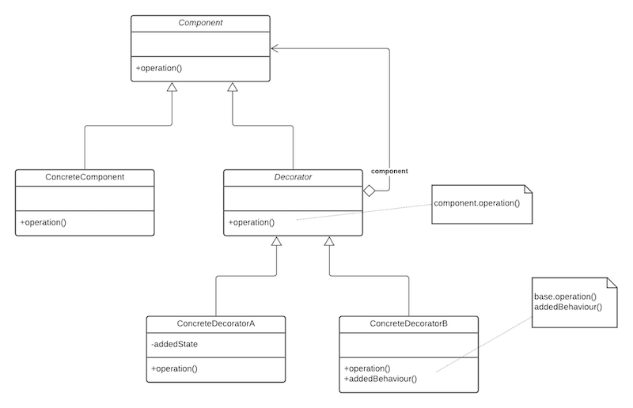

The **decorator pattern** is used to attach additional responsibilities to an object _dynamically_. The object provides 
the basic functionality, but you need a variety of additional functionality to be added at run-time. 
For example, you want to add a header and / or footer to an invoice print, and the header or footer can also vary. 
The power of the Decorator pattern is that the instantiation of the chain of objects is completely **decoupled** from the 
client objects that use the decorated `ConcreteComponent`. It allows for extending the functionality of an object without 
resorting to sub-classing.

The `ConcreteComponent` is the class having the functionality added to it by wrapping it with successive `ConcreteDecorators`
in a chain. The chain of instantiation **always** ends with the `ConcreteComponent`. Create an abstract class that 
represents the original class and the new functions to be added. In the decorators, place the new function call before 
or after the trailing calls to get the correct order.

The Decorator's inheritance of `Component` is for type matching, **not** to inherit behaviour. 
The decorator wraps a `Component` because it _aggregates_ it, i.e. it holds a pointer to it. 
`Decorator` is shown as abstract, the concrete decorator classes can add new methods and/or attributes; but typically by 
doing computation before or after an existing method in the `Component`.

Some example code for the creation of an object, and subsequent wrapping with decorators is found below

```jsx
Component myComponent;  

myComponent = new SalesTicket();  
myComponent = new Footer1(myComponent);  
myComponent = new Header1(myComponent);  

return myComponent;
```

The chain can be identified by reading the code backwards. The `Header1` decorator wraps `Footer1`, and as per the rules 
of the decorator pattern, the chain ends with the `SalesTicket` object. In an assumed `print()` method, the decorators 
could add something to be printed before calling the next object in the chains `print()` method, or after.