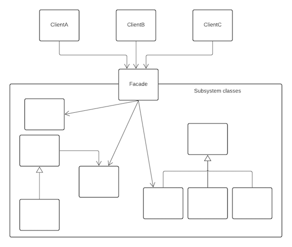

The Façade pattern enables us to use a complex system more easily, either to use just a subset of the system or to use the system in a particular way. You would use this pattern if you had a complicated system and wanted an easy to use interface to it, or to have a customised way of using it.

## Key Features

### Intent

you want to simplify how to use an existing system. You need to define your own interface.

### Problem

you need to use only a subset of a complex system, or you need to interact with a system in a particular way.

### Solution

the Façade presents a new simpler interface for the client of the existing system and reduces the number of objects to deal with.

### Consequences

certain functionality may not be available to the client, but also new methods can be written for new functionality. It may also be used to hide or encapsulate the system.