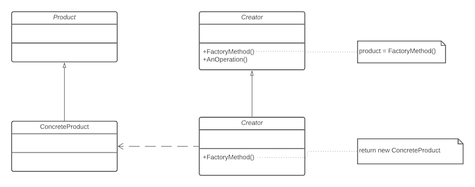

The factory method pattern is used when a class needs to instantiate a derivation of another class, but does not know which one. The factory method allows a derived class to make this decision.

* Product is the interface for the type of object that the factory creates
* Creator is the interface that defines the Factory Method
* Clients will need to subclass Creator to make a particular ConcreteProduct
* The abstract method FactoryMethod() is implemented in the concrete class and it knows the rules to enable it to create and return the appropriate concrete product.