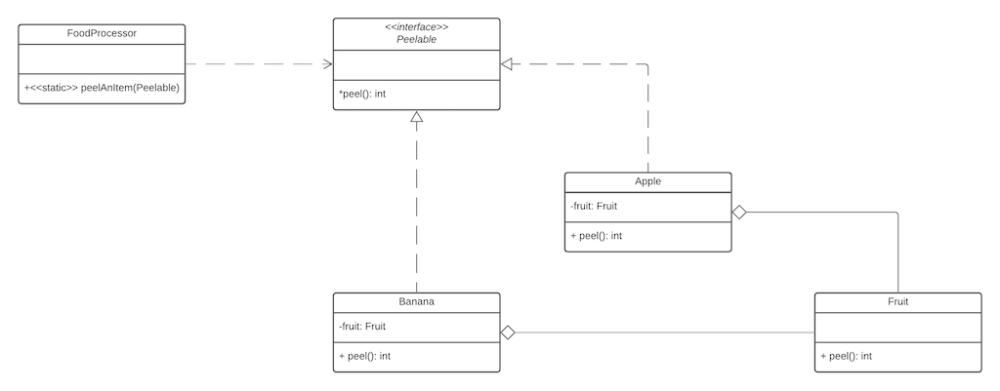

**The fragile base class** problem is caused by the use of _implementation inheritance_. It occurs when a derived class extends a base class, using some of the methods or attributes in the base class.



The derived class is tightly coupled to the base class. This is because the derived class expects the methods or attributes of the base class that it uses, to be of a certain type, or do things in a certain way. This means you cannot modify the base class without having to examine every derived class that inherits from the base class, and the client code that uses either the base or derived class objects.

Let's look at an example to illustrate the problem.

```jsx
class Fruit {  
  // Return int number of pieces of peel that resulted from the peeling activity  
  public int peel() {  
    return 1;  
  }  
}  
  
class Apple extends Fruit { }  
  
class Example1 {  
  public static void main(String[] args) {  
    Apple apple = new Apple();  
    int pieces = apple.peel();  
  }  
}
```

What would happen if you changed the return type of `peel` from `int` to the type `Peel`?

The client code now no longer works as it is expecting an `int` to be returned, even though the class `Example1` never explicitly mentions the `Fruit` class

__coupling__ The undesirable reliance of one part of a program on another part

Code Reuse via Composition
--------------------------

**Composition** provides an alternative way for `Apple` to reuse `Fruit's` implementation of `peel()`. Instead of extending `Fruit`, `Apple` can hold a reference to a `Fruit` instance and define its own `peel()` method that simply invokes `peel()` on the `Fruit`.

```jsx
class Fruit {  
  // Return int number of pieces of peel that resulted from the peeling activity  
  public int peel() {  
    return 1;  
  }  
}  
  
class Apple extends Fruit {  
  private Fruit fruit = new Fruit();  
  public int peel() {  
    return fruit.peel();  
  }  
}  
  
class Example2 {  
  public static void main(String[] args) {  
    Apple apple = new Apple();  
    int pieces = apple.peel();  
  }  
}
```

The **composition** approach to code reuse provides **stronger encapsulation** than **inheritance**, because a change to a back-end class (`Fruit`) needn't break any code that relies only on the front-end class. For example, changing the return type of Fruit's `peel()` method from an `int` to a `Peel` doesn't force a change in `Apple`'s interface and therefore needn't break class `Example2`

```jsx
class Fruit {  
  // Return Peel number of pieces of peel that resulted from the peeling activity  
  public Peel peel() {  
    return Peel(1);  
  }  
}  
  
class Apple extends Fruit {  
  // Apple must be changed to accommodate the change to Fruit  
  private Fruit fruit = new Fruit();  
  public int peel() {  
    Peel peel = fruit.peel();  
    return peel.getPeelCount();  
  }  
}  
  
class Example2 {  
  public static void main(String[] args) {  
    Apple apple = new Apple();  
    int pieces = apple.peel();  
  }  
}
```

Obtaining Polymorphism Using Composition
----------------------------------------

**Polymorphism** is still possible when using composition, but we need to use **type inheritance** to gain a common parent type.

In the diagram, the `FoodProcessor` can peel anything that implements `Peelable` since these objects all inherit the `Peelable` type.

_Note_ that there is **polymorphism** with the subtypes of `Peelable` using `peel()`, but the `peel` implementation is always delegated to `Fruit`.
