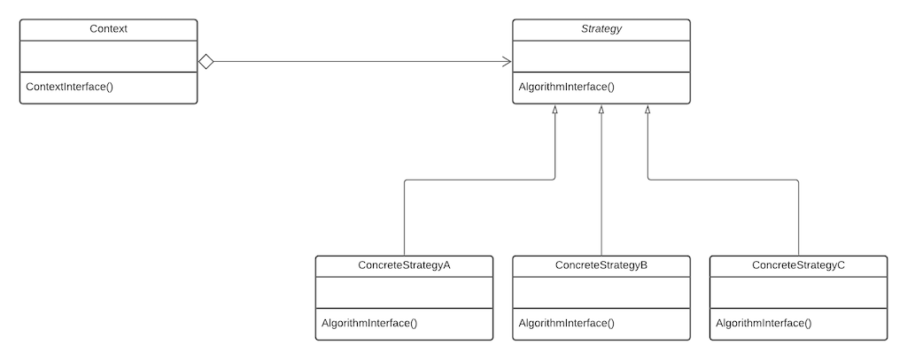

The GoF describe the strategy pattern as;

Define a family of algorithms, encapsulate each one, and make them interchangeable. Strategy lets the algorithm vary independently from clients that use it.

The strategy pattern enables you to use different rules or algorithms depending on the context they occur. For example in a system calculating the tax due on different assetts, different tax rules (algorithms) are used depending on the type of asset being considered.

The strategy pattern defines a family of algorithms. It helps to eliminate complex switches and conditionals (if...elseif...else). The algorithms are invoked the same way (as they must all have the same _interface_).

The class that uses the algorithm (Context) contains an abstract class (Strategy) that has an abstract method which specifies how to call the algorithm. Each derived class (ConcreteStrategy) implements the algorithm as needed. Typically, the responsibility for selecting which concrete implementation to use is done by the client object, and is given to the context object of the strategy pattern.